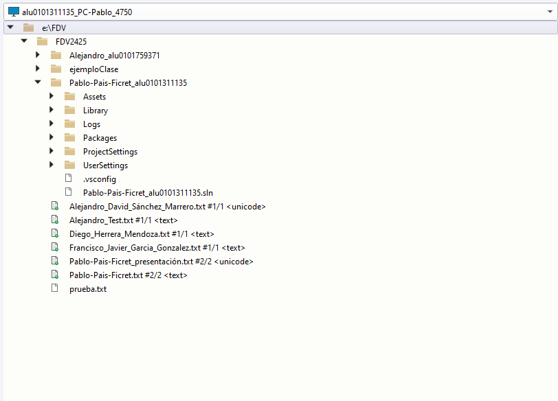

# 1.3-Unity-Perforce
## Experimentar el control de versiones con Perforce
    1. Crear una conexión al depósito FDV2425
    2. Clonar el repositorio
    3. Modificar el fichero presentacion.txt
    4. Crear un fichero nuevo, tu_nombre.txt y añádelo al proyecto
    5. Crear un proyecto Unity 3D básico y agregarlo al depot de la asignatura

### Conexión con el deposito

Antes de acceder a la interfaz del programa (Figura 1), hay que conectarse al servidor de perforce de ULL. Para conectarse al mismo hay que utilizar las creedenciales de la ULL junto a la siguiente dirección donde se aloja el servidor```ssl:mudv-vcs.iaas.ull.es:1666```.


*Figura 1: Deposito FDV2425*

### Clonar repositorio


*Figura 2: Repositorio clonado en mi ordenador*

### Modificar presentacion.txt

En vez de modificar el fichero, cree mi fichero donde escribí mi presentación.


*Figura 3: Fichero de presentación*

### Crear fichero nuevo


*Figura 4: Deposito con mis ficheros*

### Crear y agregar proyecto al deposito

Primero cree el proyecto de Unity en mi ordenador en la carpeta donde clone el deposito de perforce (Figura 5). Posteriormente, el proyecto de Unity lo subí al perforce (Figura 6).



*Figura 5: Proyecto de Unity en mi ordenador*


*Figura 6: Proyecto de Unity en el desposito*
